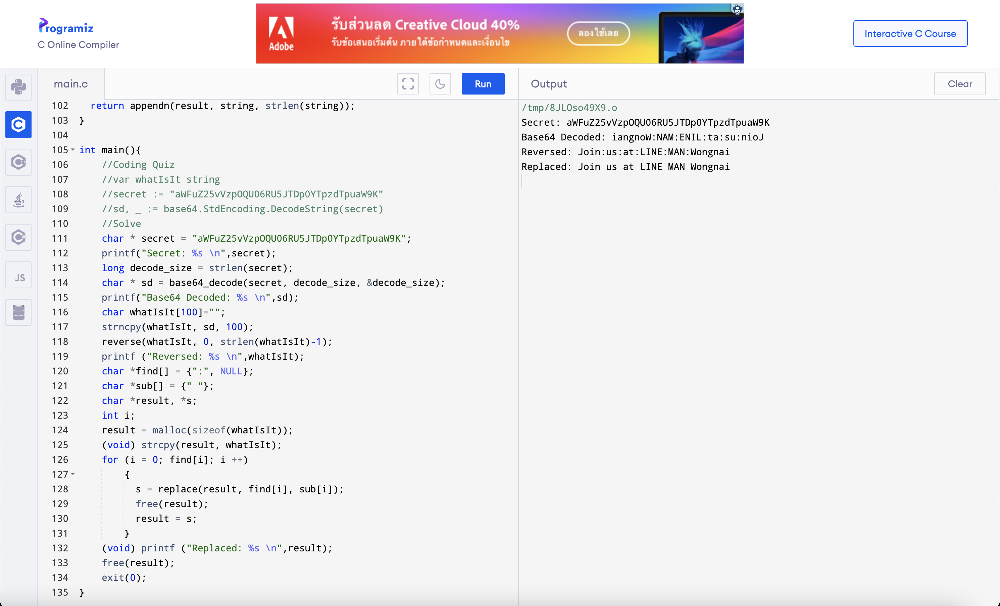
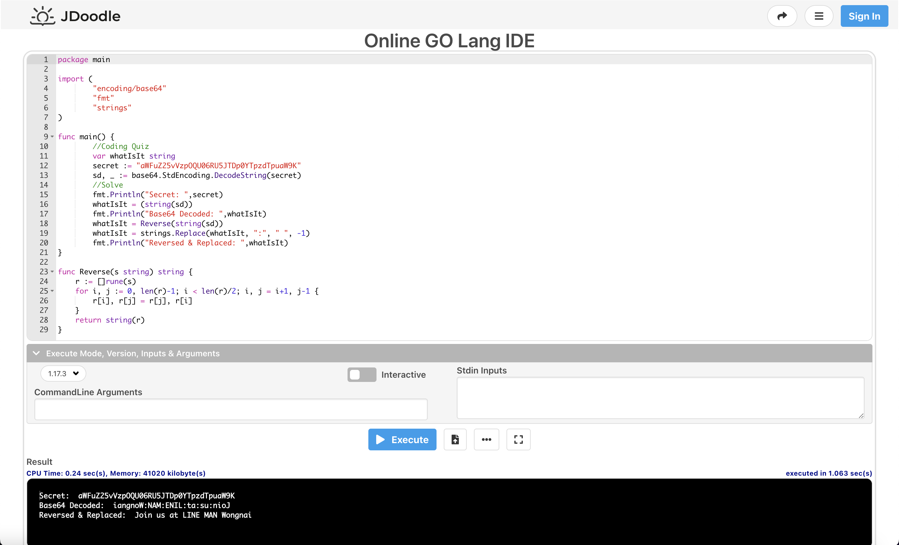

# LINE-MAN-Wongnai-Mysterious-Code
Solve the challenge and Save your spot for a fast track interview with LINE MAN Wongnai Engineering Team.
## Original Repository
```
https://github.com/LINEMANWongnai/LINE-MAN-Wongnai-Mysterious-Code
```
## Coding Quiz
```
var whatIsIt string
secret := "aWFuZ25vVzpOQU06RU5JTDp0YTpzdTpuaW9K"
sd, _ := base64.StdEncoding.DecodeString(secret)
```
## Solved by swzhouu.c
```
#include <stdio.h>
#include <stdint.h>
#include <stdlib.h>
#include <string.h>

static char encoding_table[] = {'A', 'B', 'C', 'D', 'E', 'F', 'G', 'H',
                                'I', 'J', 'K', 'L', 'M', 'N', 'O', 'P',
                                'Q', 'R', 'S', 'T', 'U', 'V', 'W', 'X',
                                'Y', 'Z', 'a', 'b', 'c', 'd', 'e', 'f',
                                'g', 'h', 'i', 'j', 'k', 'l', 'm', 'n',
                                'o', 'p', 'q', 'r', 's', 't', 'u', 'v',
                                'w', 'x', 'y', 'z', '0', '1', '2', '3',
                                '4', '5', '6', '7', '8', '9', '+', '/'};
static char *decoding_table = NULL;
static int mod_table[] = {0, 2, 1};

void build_decoding_table() {
    decoding_table = malloc(256);
    for (int i = 0; i < 64; i++)
        decoding_table[(unsigned char) encoding_table[i]] = i;
}

void base64_cleanup() {
    free(decoding_table);
} 

char *base64_encode(const unsigned char *data,
                    size_t input_length,
                    size_t *output_length) {
    *output_length = 4 * ((input_length + 2) / 3);
    char *encoded_data = malloc(*output_length);
    if (encoded_data == NULL) return NULL;
    for (int i = 0, j = 0; i < input_length;) {
        uint32_t octet_a = i < input_length ? (unsigned char)data[i++] : 0;
        uint32_t octet_b = i < input_length ? (unsigned char)data[i++] : 0;
        uint32_t octet_c = i < input_length ? (unsigned char)data[i++] : 0;
        uint32_t triple = (octet_a << 0x10) + (octet_b << 0x08) + octet_c;
        encoded_data[j++] = encoding_table[(triple >> 3 * 6) & 0x3F];
        encoded_data[j++] = encoding_table[(triple >> 2 * 6) & 0x3F];
        encoded_data[j++] = encoding_table[(triple >> 1 * 6) & 0x3F];
        encoded_data[j++] = encoding_table[(triple >> 0 * 6) & 0x3F];
    }
    for (int i = 0; i < mod_table[input_length % 3]; i++)
        encoded_data[*output_length - 1 - i] = '=';
    return encoded_data;
}

unsigned char *base64_decode(const char *data,
                             size_t input_length,
                             size_t *output_length) {
    if (decoding_table == NULL) build_decoding_table();
    if (input_length % 4 != 0) return NULL;
    *output_length = input_length / 4 * 3;
    if (data[input_length - 1] == '=') (*output_length)--;
    if (data[input_length - 2] == '=') (*output_length)--;
    unsigned char *decoded_data = malloc(*output_length);
    if (decoded_data == NULL) return NULL;
    for (int i = 0, j = 0; i < input_length;) {
        uint32_t sextet_a = data[i] == '=' ? 0 & i++ : decoding_table[data[i++]];
        uint32_t sextet_b = data[i] == '=' ? 0 & i++ : decoding_table[data[i++]];
        uint32_t sextet_c = data[i] == '=' ? 0 & i++ : decoding_table[data[i++]];
        uint32_t sextet_d = data[i] == '=' ? 0 & i++ : decoding_table[data[i++]];
        uint32_t triple = (sextet_a << 3 * 6)
        + (sextet_b << 2 * 6)
        + (sextet_c << 1 * 6)
        + (sextet_d << 0 * 6);
        if (j < *output_length) decoded_data[j++] = (triple >> 2 * 8) & 0xFF;
        if (j < *output_length) decoded_data[j++] = (triple >> 1 * 8) & 0xFF;
        if (j < *output_length) decoded_data[j++] = (triple >> 0 * 8) & 0xFF;
    }
    return decoded_data;
}

void reverse(char*, int, int);
void reverse(char *x, int begin, int end)
{
   char c;
   if (begin >= end)
      return;
   c          = *(x+begin);
   *(x+begin) = *(x+end);
   *(x+end)   = c;
   reverse(x, ++begin, --end);
}

char *appendn(char *to, char *from, int length)
{
  return strncat(realloc(to, strlen(to) + length + 1), from, length);
}
char *replace(char *string, char *find, char *sub)
{
  char *result = calloc(1, 1);
  while (1)
    {
      char *found = strstr(string, find);
      if (!found)
        break;
      result = appendn(result, string, found - string);
      result = appendn(result, sub, strlen(sub));
      string = found + strlen(find);
    }
  return appendn(result, string, strlen(string));
}

int main(){
    //Coding Quiz
    //var whatIsIt string
    //secret := "aWFuZ25vVzpOQU06RU5JTDp0YTpzdTpuaW9K"
    //sd, _ := base64.StdEncoding.DecodeString(secret)
    //Solve
    char * secret = "aWFuZ25vVzpOQU06RU5JTDp0YTpzdTpuaW9K";
    printf("Secret: %s \n",secret);
    long decode_size = strlen(secret);
    char * sd = base64_decode(secret, decode_size, &decode_size);
    printf("Base64 Decoded: %s \n",sd);
    char whatIsIt[100]="";
    strncpy(whatIsIt, sd, 100);
    reverse(whatIsIt, 0, strlen(whatIsIt)-1);
    printf ("Reversed: %s \n",whatIsIt);
    char *find[] = {":", NULL};
    char *sub[] = {" "};
    char *result, *s;
    int i;
    result = malloc(sizeof(whatIsIt));
    (void) strcpy(result, whatIsIt);
    for (i = 0; find[i]; i ++)
        {
          s = replace(result, find[i], sub[i]);
          free(result);
          result = s;
        }
    (void) printf ("Replaced: %s \n",result);
    free(result);
    exit(0);
}
```
## swzhouu.c Output
```
Secret: aWFuZ25vVzpOQU06RU5JTDp0YTpzdTpuaW9K 
Base64 Decoded: iangnoW:NAM:ENIL:ta:su:nioJ 
Reversed: Join:us:at:LINE:MAN:Wongnai 
Replaced: Join us at LINE MAN Wongnai
```
## Using C Online Compiler

## Solved by swzhouu.go
```
package main

import (
        "encoding/base64"
        "fmt"
        "strings"
)

func main() {
        //Coding Quiz
        var whatIsIt string
        secret := "aWFuZ25vVzpOQU06RU5JTDp0YTpzdTpuaW9K"
        sd, _ := base64.StdEncoding.DecodeString(secret)
        //Solve
        fmt.Println("Secret: ",secret)
        whatIsIt = (string(sd))
        fmt.Println("Base64 Decoded: ",whatIsIt)
        whatIsIt = Reverse(string(sd))
        whatIsIt = strings.Replace(whatIsIt, ":", " ", -1)
        fmt.Println("Reversed & Replaced: ",whatIsIt)
}

func Reverse(s string) string {
    r := []rune(s)
    for i, j := 0, len(r)-1; i < len(r)/2; i, j = i+1, j-1 {
        r[i], r[j] = r[j], r[i]
    }
    return string(r)
}
```
## swzhouu.go Output
```
Secret:  aWFuZ25vVzpOQU06RU5JTDp0YTpzdTpuaW9K
Base64 Decoded:  iangnoW:NAM:ENIL:ta:su:nioJ
Reversed & Replaced:  Join us at LINE MAN Wongnai
```
## Using Online GO Lang IDE

